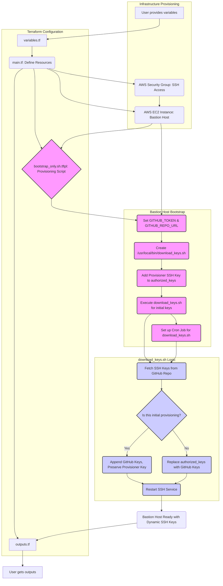

# Bastion Host SSH Key Management and Audit System

This document outlines the workflow for managing SSH access to the bastion host and using the audit functionality to track user sessions.

## Overview

The bastion host automatically downloads SSH public keys from a GitHub repository and updates both system-wide and user-specific authorized_keys files. It also maintains a mapping between SSH keys and email identifiers for audit purposes. The system includes immutable flag protection for authorized_keys files and comprehensive audit logging of SSH sessions.

Current bastion host IP: **44.204.88.224**

## Deployment

The bastion host is deployed with fully integrated SSH key management and audit functionality:

1. Ensure your SSH private key path is correctly set in `terraform/terraform.tfvars`:

   ```hcl
   ssh_private_key_path = "/path/to/your/private/key"
   ```

2. Deploy the bastion host with Terraform:

   ```bash
   cd terraform
   terraform apply
   ```

The deployment process automatically:

- Provisions the EC2 instance with the bootstrap script
- Sets up SSH key management from GitHub
- Uploads and executes the enhanced audit script
- Configures audit logging and key mapping
- Sets up the cron job for regular key updates

## SSH Access Workflow

### Adding a New SSH Key

1. Generate an SSH key pair if you don't already have one:

   ```bash
   ssh-keygen -t ed25519 -C "your.email@example.com"
   ```

2. Add your public key to the GitHub repository:

   - Create a pull request to add your public key to the `authorized_keys` file
   - Ensure your key includes your email as a comment at the end (this is used for audit tracking)
   - Example format: `ssh-ed25519 AAAAC3NzaC1lZDI1NTE5AAAAIJtqgJBgVrN8xCYXDqXGJCzFW9TCQXWGIhPw4xkwiZ9X your.email@example.com`

3. Get your PR approved and merged

4. Wait for the key to be propagated:
   - Keys are automatically updated every 30 minutes via a cron job
   - Your key should be available within 30 minutes of being merged

### Forcing an Immediate Key Update

In break-glass situations where immediate access is needed without waiting for the 30-minute cron job, ask your administrator to:

1. SSH into the bastion host
2. Run the download script manually:
   ```bash
   sudo /usr/local/bin/download_keys.sh
   ```

3. Verify your key was added:
   ```bash
   grep "your.email@example.com" /etc/ssh/authorized_keys
   ```

## Audit Functionality

The bastion host includes audit functionality that tracks SSH logins and associates them with email identifiers.

### Key Features

- **Email-based Identity Tracking**: SSH keys are mapped to email identifiers
- **Session Tracking**: Each SSH session is logged with the user's email
- **Audit Logging**: All SSH activities are logged for security and compliance
- **Immutable Protection**: Authorized keys files are protected with immutable flags to prevent unauthorized modifications

### Searching for User Sessions

To find all SSH sessions associated with a specific email:

```bash
sudo /usr/local/bin/search-by-email.sh user.email@example.com
```

This will display:
- All session IDs associated with that email
- Log entries for each session

### Audit Workflow

The bastion host's audit system tracks SSH sessions by email identifier, allowing you to monitor who accessed the system and what they did. Here's how to use it:

#### Step 1: List Available Email Identifiers

To see which email identifiers are currently mapped to SSH keys:

```bash
sudo ls -la /etc/ssh/key_mapping/
sudo cat /etc/ssh/key_mapping/*
```

This shows all email identifiers that have accessed the system.

#### Step 2: Find Sessions for a Specific User

To find all SSH sessions associated with a specific email:

```bash
sudo /usr/local/bin/search-by-email.sh user.email@example.com
```

This will display:
- All session IDs associated with that email
- Log entries for each session

#### Step 3: View Detailed Session Activity

Once you have the session IDs, you can view detailed activity:

```bash
sudo ausearch -k ssh_sessions | grep <session-id>
```

#### Step 4: View SSH Configuration Changes

To monitor changes to SSH configuration:

```bash
sudo ausearch -k sshd_config
```

This audit workflow allows you to track who accessed the system, when they connected, and what activity occurred during their session.

### Viewing Raw Auth Logs

To view the raw authentication logs:

```bash
sudo grep "SSH LOGIN" /var/log/auth.log
```

## Project Flow Diagram



## Troubleshooting

### Key Mapping Issues

If your email is not being correctly associated with your SSH key:

1. Verify your key has the correct email comment:
   ```bash
   grep "your.email@example.com" /etc/ssh/authorized_keys
   ```

2. Manually update the key mappings:
   ```bash
   sudo /usr/local/bin/update_key_mappings.sh
   ```

3. Check if your key was mapped correctly:
   ```bash
   sudo ls -la /etc/ssh/key_mapping/
   ```

### SSH Access Issues

If you're having trouble accessing the bastion host:

1. Verify your public key is in the GitHub repository
2. Check if your key was downloaded to the bastion host:
   ```bash
   sudo grep "your.email@example.com" /etc/ssh/authorized_keys
   ```

3. Force an update of the keys:
   ```bash
   sudo /usr/local/bin/download_keys.sh
   ```

## Technical Details

- Keys are stored in both `/etc/ssh/authorized_keys` (system-wide) and `/home/ubuntu/.ssh/authorized_keys` (user-specific)
- Key mappings are stored in `/etc/ssh/key_mapping/`
- Session mappings are stored in `/etc/ssh/session_mappings/`
- Audit logs are stored in `/var/log/audit/audit.log` and `/var/log/auth.log`
- The key update script runs every 30 minutes via cron
- The system uses immutable flags to protect authorized_keys files from unauthorized modifications
- A marker file (`/etc/ssh/.initial_provisioning_complete`) is used to distinguish between initial provisioning and subsequent key updates

## Security Considerations

- SSH keys are the only method of authentication allowed
- All SSH sessions are logged with the user's email identifier
- Audit logs are maintained for security and compliance purposes
- The system is designed to be secure and maintainable

## Infrastructure Management

The bastion host is managed using Terraform. The configuration files are located in the `terraform/` directory.

To update the infrastructure:

1. Make changes to the Terraform files
2. Run `terraform apply` to apply the changes

The current implementation includes:

- Automatic provisioning of the bastion host with SSH key management
- Automatic upload and execution of the enhanced audit script via provisioners
- Terraform variables for GitHub token, repository URL, and SSH private key path
- Security group configuration for SSH access

For future enhancements, consider:

- Using GitHub Actions to trigger key updates based on repository changes
- Implementing more restrictive security group rules
- Adding CloudWatch monitoring and alerting
